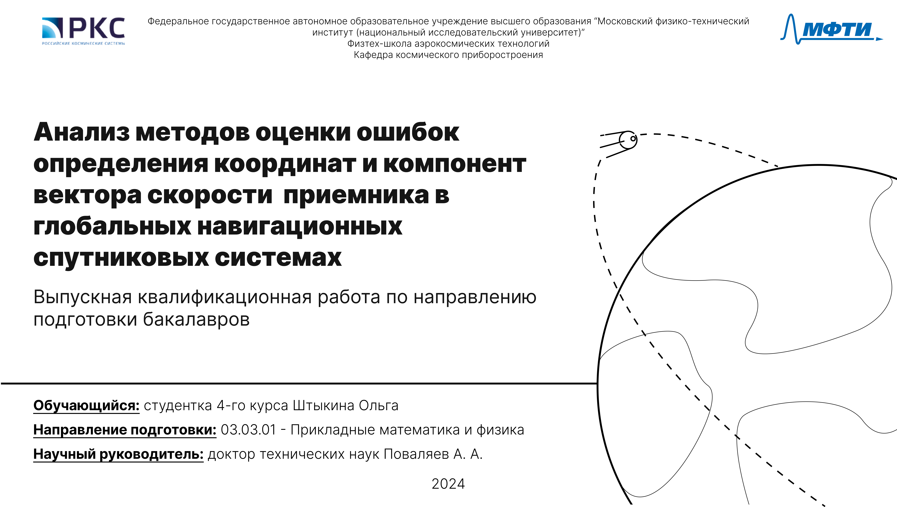
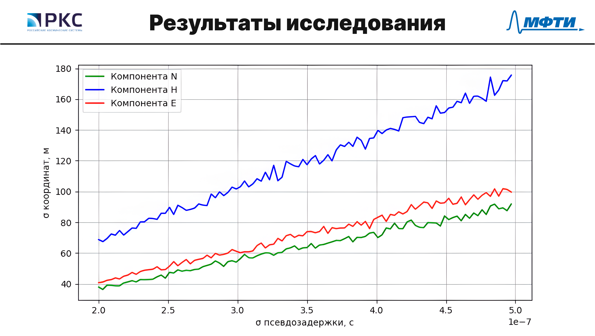
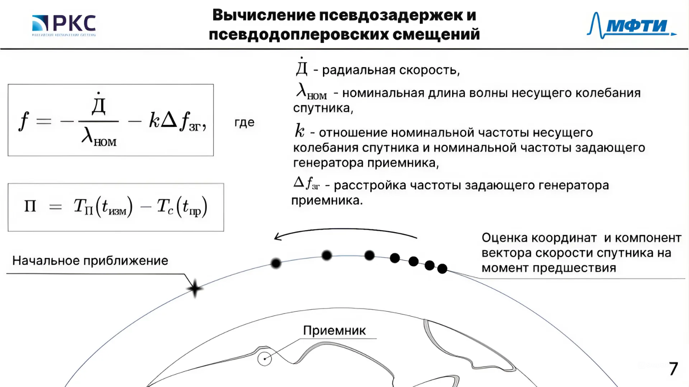

# Портфолио

## Проекты

* **[Калькулятор параметров тренировки](https://github.com/kirxx12/hw_python_oop):**

  Этот проект предоставляет набор классов Python для расчета параметров различных типов тренировок (бег, ходьба, плавание), таких как дистанция, средняя скорость и потраченные калории.

* **[Telegram бот для развлечений и поиска товаров](https://github.com/kirxx12/myStory):** 

    Telegram бот, который предоставляет пользователям анекдоты, фотографии и помогает найти цены на музыкальные товары в интернет-магазинах.  Использует парсинг веб-сайтов и взаимодействует с Telegram API.

* **[Обучение нейронной сети для распознавания рукописных символов](https://github.com/kirxx12/nn):** 

    Проект обучает нейронную сеть распознавать рукописные символы с помощью набора данных EMNIST и библиотеки Keras.  Включает две модели разной сложности и функционал для дообучения.

* **[Telegram бот для подготовки к экзаменам](https://github.com/kirxx12/mybot):**  

    Асинхронный Telegram бот, который помогает готовиться к экзаменам по математике и информатике, предоставляя случайные задания и проверяя ответы.  Использует aiogram и SQLite для хранения данных.


## Дизайн

* **Дизайн презентации для ВКР для студентки бакалавриата МФТИ**

    Открывающий слайд:
    
    

    !Визуализация данных:

    

    Формулы:

    

* **Разработка дизайна для выступления команды TECHCULT в рамках чемпионата История будущего 2024**

    Открывающий слайд:
    
    

    Одностраничный фрейм:

    

    Попадание в проблему слушателя:

    

    Разработка дизайна буклета 1:

    

    Разработка дизайна буклета 2:

    


---

**Заметки:**
* Вы можете добавить больше информации в каждый раздел, например, ключевые технологии, используемые библиотеки, инструкции по установке и запуску.
```
